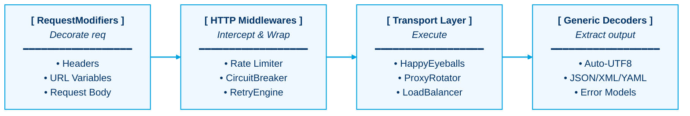

<div align="center">

# ❄️ aoni

### The Ice-Cold Resilience Engine for Go HTTP & Real-Time Networks

[](https://pkg.go.dev/github.com/lemon4ksan/aoni)
[](https://goreportcard.com/report/github.com/lemon4ksan/aoni)
[](LICENSE)

> _"In networks, chaos is the default. Let aoni be your ice-cold anchor."_

#### 🇺🇸 [English](README.md) • 🇷🇺 [Русский](README_RU.md)

</div>

### Why Aoni?

When integrating with unstable APIs, scraping, or working with complex proxy networks in Go, the standard `net/http` client often requires significant boilerplate to handle real-world challenges like proxy rotation, rate limits, legacy charsets, or TLS fingerprinting. 

`aoni` bridges this gap. It models HTTP requests as pipeline flows processed by declarative **RequestModifiers** and standard Go **Middlewares**, leveraging generics for type-safe response decoding. It remains unwavering under network load, just like the blue oni.

```shell
go get github.com/lemon4ksan/aoni
```

## 🎯 When to Use Aoni vs. Standard Clients (e.g., Resty)

`aoni` is not designed to replace `net/http` or lightweight wrappers like `resty` for standard, internal corporate microservices where raw, flat throughput over direct, reliable cloud connections is the only concern.

* **Choose `net/http` / `resty`** for: Internal microservices, direct cloud API integrations (AWS/S3, Stripe, Twilio), and standard high-throughput REST APIs where you fully control the destination server and the network environment.
* **Choose `aoni`** for: Deep-packet inspection (DPI) evasion, scraping/crawling targets behind aggressive firewalls (Cloudflare, Akamai, Imperva), rotating unstable proxy networks with sticky sessions, and real-time WebSockets over HTTP/2. It is your **tactical off-road armor** for uncooperative and chaotic network environments.

## 🌀 The Pipeline Philosophy

In `aoni`, a request is not a static object—it is a fluid stream processed in four distinct, highly optimized phases:



## ⚡ The Contrast: Standard Library vs. Aoni

To make a JSON request through a resilient proxy pool with retries and custom error parsing, standard Go requires manual loop management, type casting, and verbose transport setup. 

Here is how the two approaches compare:

<table width="100%">
<tr>
<th width="50%">Standard <code>net/http</code> (Manual Setup)</th>
<th width="50%">Using <code>aoni</code> (Declarative & Resilient)</th>
</tr>
<tr>
<td valign="top">

```go
// 🛑 Verbose, unsafe state handling
transport := &http.Transport{
    Proxy: http.ProxyURL(proxyURL),
}
client := &http.Client{Transport: transport}

var lastErr error
for i := 0; i < 3; i++ {
    req, _ := http.NewRequestWithContext(ctx, "GET", url, nil)
    resp, err := client.Do(req)
    if err != nil {
        lastErr = err
        time.Sleep(backoff)
        continue
    }
    defer resp.Body.Close()
    
    if resp.StatusCode != http.StatusOK {
        // Must manually decode error schema...
    }
    
    // Must manually decode JSON...
    err = json.NewDecoder(resp.Body).Decode(&user)
    break
}
```

</td>
<td valign="top">

```go
// ❄️ Clean, immutable, pipeline-driven flow
client := aoni.NewClient(transportChain)

user, err := aoni.GetJSON[User](ctx, client, "/users/{id}",
    aoni.WithVar("id", 123),
    aoni.WithErrorModel(&apiErr),
)
```

</td>
</tr>
</table>

## 📊 Feature Matrix

This matrix shows where `aoni` focuses its design compared to Go's default capabilities and generic wrappers:

| Feature / Capability | Go `net/http` | Standard Wrapper (e.g., Resty) | `aoni` |
| :--- | :---: | :---: | :---: |
| **Generics-first Decoding** | ✗ (Manual) | ✗ (Interface-based) | **✓ (Type-safe `[T]`)** |
| **Parallel "Happy Eyeballs" Dialing** | ⚠️ (Basic) | ✗ | **✓ (RFC 8305)** |
| **Active Circuit Breaking** | ✗ | ✗ | **✓ (Native Middleware)** |
| **Polite `Retry-After` Parsing** | ✗ | ✗ | **✓ (Delta-sec & RFC1123)** |
| **Non-UTF8 Charset Translation** | ✗ | ✗ | **✓ (Automatic)** |
| **TLS Evasion (JA3/JA4)** | ✗ | ✗ | **✓ (via `uTLS` & Handshake)** |
| **JA4+ Fingerprinting** | ✗ | ✗ | **✓ (TLS & HTTP, pure Go)** |
| **Sub-millisecond Tracing** | ⚠️ (Verbose) | ✗ | **✓ (Single-modifier)** |
| **Socket.IO / Engine.IO v4 Client** | ✗ | ✗ | **✓ (Complete v5 Spec)** |

---

## 🍳 Cookbook: Common Resiliency Recipes

Instead of dry features, here is how you solve common, frustrating networking challenges with `aoni`.

### 1. Transparent Proxy Rotation with Sticky Sessions
* **The Problem:** You need to rotate proxies to distribute load, but specific user requests must land on the exact same proxy address to preserve their active session state.
* **The Ice-Cold Solution:**

```go
p1, _ := aoni.NewProxyClient(aoni.ProxyConfig{ProxyURL: "http://proxy1.local"})
p2, _ := aoni.NewProxyClient(aoni.ProxyConfig{ProxyURL: "http://proxy2.local"})

rotator, _ := aoni.NewProxyRotator(aoni.ProxyRotatorConfig{
    MaxFails:   3,
    RetryAfter: 30 * time.Second,
}, p1, p2)

// Lock proxy selection dynamically based on the request's session cookie
stickyRotator := rotator.WithStickySessions(func(req *http.Request) string {
    if c, err := req.Cookie("sessionid"); err == nil {
        return c.Value
    }
    return ""
})

client := aoni.NewClient(aoni.Chain(stickyRotator, rateLimiter))
```

### 2. Mitigating Long-Tail Latency via Hedging
* **The Problem:** Unstable proxies or overloaded servers occasionally freeze, delaying your entire execution queue.
* **The Ice-Cold Solution:** If the primary request stalls and doesn't return headers in 150ms, a backup request is dispatched in parallel, returning whichever finishes first.

```go
data, err := aoni.GetJSON[Data](ctx, aoni.NewClient(hedgedClient), "/data", WithHedging(10*time.Millisecond))
```

### 3. Automatic Legacy Charset Translation
* **The Problem:** Legacy regional APIs or crawled websites return text encoded in old charsets (e.g., Cyrillic or Asian legacy encodings), resulting in garbled characters during JSON unmarshaling.
* **The Ice-Cold Solution:** `aoni` detects the encoding on-the-fly from the headers and transparently translates the stream to standard UTF-8 before passing it to any decoder.

```go
manifest, err := aoni.GetJSON[Manifest](ctx, client, "/legacy-manifest",
    aoni.WithDownloadProgress(func(current, total int64) {
        fmt.Printf("Downloaded %d of %d bytes\n", current, total)
    }),
)
```

### 4. Modern WAF Evasion & JA4 Fingerprinting
* **The Problem:** Modern Web Application Firewalls (WAFs like Cloudflare or Akamai) block automated requests based on TLS ClientHello fingerprints (JA3/JA4) and HTTP header ordering (JA4H).
* **The Ice-Cold Solution:** `aoni` natively emulates modern browser TLS handshakes using `uTLS` and automatically aligns headers to generate a clean, completely browser-compliant fingerprint. The built-in [`ja4`](ja4/) subpackage provides pure-Go JA4/JA4H computation.

```go
info := &aoni.TraceInfo{}

client := aoni.NewClient(nil).
    WithTLSFingerprint(aoni.BrowserChrome). // Spoofs TLS ClientHello
    WithJA4Callback(func(r ja4.JA4Report) {
        fmt.Println("Active TLS Handshake JA4:", r.JA4)
    })

user, err := aoni.GetJSON[User](ctx, client, "/profile", 
    aoni.Trace(info), 
    aoni.TraceJA4(info), // Traces both TLS (JA4) and HTTP (JA4H) fingerprints
)

fmt.Println("Handshake TLS JA4:", info.JA4.JA4)   // "t13d1516h2_8daaf6152771_e5627efa2ab1"
fmt.Println("Request HTTP JA4H:", info.JA4.JA4H)  // "ge11nn03enus_9ed1ff1f7b03_cd8dafe26982"
```

### 5. Bulletproof, Real-Time Socket.IO v5 / Engine.IO v4 Streaming
* **The Problem:** Real-time web sockets on protected servers get blocked during handshake due to standard Go TLS fingerprints, or silent TCP disconnects go unnoticed.
* **The Ice-Cold Solution:** `aoni` establishes fully authenticated, JA4-spoofed, proxy-routed Socket.IO v5 sessions over standard WebSockets or stealthy HTTP/2 Extended CONNECT tunnels. It includes automatic, jittered backoff reconnection and ping-timeout heartbeats natively.

```go
cfg := aoni.SocketIOConfig{
    Reconnection: true,
    Namespace:    "/realtime-prices",
    Auth:         map[string]string{"token": "my-secure-token"},
}

// Automatically inherits proxy rotators, DoT, JA4, and SSRF guards from the client!
sio, err := aoni.DialSocketIO(ctx, client, "wss://api.pricedb.io", cfg)
if err != nil {
    log.Fatal(err)
}

sio.On("price_update", func(args []json.RawMessage) {
    var price Price
    _ = json.Unmarshal(args[0], &price)
    fmt.Printf("Live Price: %s -> %.2f\n", price.SKU, price.Value)
})
```

### 6. Diagnostic Tracing & Offline Debugging
* **The Problem:** Tracking network bottlenecks across proxies is difficult, and recreating failing requests in terminal for manual verification takes time.
* **The Ice-Cold Solution:**

```go
var trace aoni.TraceInfo

aoni.GetJSON[User](ctx, client, "/debug",
    aoni.Trace(&trace), // Detailed DNS, TCP, and TLS metrics
    aoni.AsCurl(),      // Prints equivalent executable curl command to stderr
)

fmt.Printf("DNS: %s | TCP Connect: %s | TLS Handshake: %s | TTFB: %s\n",
    trace.DNSLookup, trace.TCPConn, trace.TLSHandshake, trace.ServerProcessing)
```

## 🎨 Memory & Resource Footprint

While standard clients focus only on raw speed, `aoni` is engineered to protect your host application's resources when scaling to thousands of concurrent worker loops:

* **Static Heap Footprint:** Maintains an ultra-lean runtime profile, consuming roughly **~1.2 MB** of live heap memory in idle states.
* **Sync.Pool Recycled Buffers:** Utilizes pooled memory slices for body streaming, JSON parsing, and multipart encoding to keep GC overhead and "GC pauses" to a minimum.
* **Leak Defense (Finalizers):** Leverages `runtime.SetFinalizer` on critical network responses to automatically release unclosed connections and warn you about resource leaks before file descriptors are exhausted.
* **Response Bomb Protection:** Enforces strict payload reading limits (e.g. 10MB) via `io.LimitReader` on incoming responses to prevent out-of-memory (OOM) crashes from malicious or unexpectedly massive responses.

## ⚖️ Legal & License

This project is licensed under the **BSD 3-Clause License**. See [LICENSE](LICENSE) for full details.

<div align="center">
  <sub>Keep a cold head, stay unyielding. Just like the blue oni.</sub>
</div>
