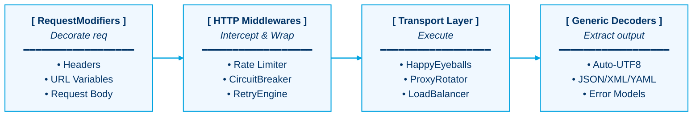

<div align="center">

# ❄️ aoni

### The Ice-Cold Resilience Engine for Go HTTP & Real-Time Networks

[](https://pkg.go.dev/github.com/lemon4ksan/aoni)
[](LICENSE)

> _"In networks, chaos is the default. Let aoni be your ice-cold anchor."_

#### 🇺🇸 [English](README.md) • 🇷🇺 [Русский](README_RU.md)

</div>

### Why Aoni?

When integrating with unstable APIs, scraping, or working with complex proxy networks in Go, the standard `net/http` client often requires significant boilerplate to handle real-world challenges like proxy rotation, rate limits, legacy charsets, or TLS fingerprinting. 

`aoni` bridges this gap. It models HTTP requests as pipeline flows processed by declarative **RequestModifiers** and standard Go **Middlewares**, leveraging generics for type-safe response decoding. It remains unwavering under network load, just like the blue oni.

```shell
go get github.com/lemon4ksan/aoni
```

## 🎯 When to Use Aoni vs. Standard Clients (e.g., Resty)

`aoni` is not designed to replace `net/http` or lightweight wrappers like `resty` for standard, internal corporate microservices where raw, flat throughput over direct, reliable cloud connections is the only concern.

* **Choose `net/http` / `resty`** for: Internal microservices, direct cloud API integrations (AWS/S3, Stripe, Twilio), and standard high-throughput REST APIs where you fully control the destination server and the network environment.
* **Choose `aoni`** for: Deep-packet inspection (DPI) evasion, scraping/crawling targets behind aggressive firewalls (Cloudflare, Akamai, Imperva), rotating unstable proxy networks with sticky sessions, and real-time WebSockets over HTTP/2. It is your **tactical off-road armor** for uncooperative and chaotic network environments.

## 🌀 The Pipeline Philosophy

In `aoni`, a request is not a static object-it is a fluid stream processed in four distinct, highly optimized phases:


```mermaid
flowchart LR
    %% Styling
    classDef ice fill:#f0f8ff,stroke:#00a3e0,stroke-width:1.5px,color:#003366;
    linkStyle default stroke:#00a3e0,stroke-width:2px;
    
    p1["<b>[ RequestModifiers ]</b><br><i>Decorate req</i><br>━━━━━━━━━━━━━━━━━━<br>• Headers<br>• URL Variables<br>• Request Body"]:::ice
    p2["<b>[ HTTP Middlewares ]</b><br><i>Intercept & Wrap</i><br>━━━━━━━━━━━━━━━━━━<br>• Rate Limiter<br>• CircuitBreaker<br>• RetryEngine"]:::ice
    p3["<b>[ Transport Layer ]</b><br><i>Execute</i><br>━━━━━━━━━━━━━━━━━━<br>• HappyEyeballs<br>• ProxyRotator<br>• LoadBalancer"]:::ice
    p4["<b>[ Generic Decoders ]</b><br><i>Extract output</i><br>━━━━━━━━━━━━━━━━━━<br>• Auto-UTF8<br>• JSON/XML/YAML<br>• Error Models"]:::ice
    
    p1 --> p2 --> p3 --> p4
```

## ⚡ The Contrast: Standard Library vs. Aoni

To make a JSON request through a resilient proxy pool with retries and custom error parsing, standard Go requires manual loop management, type casting, and verbose transport setup. 

Here is how the two approaches compare:

<table width="100%">
<tr>
<th width="50%">Standard <code>net/http</code> (Manual Setup)</th>
<th width="50%">Using <code>aoni</code> (Declarative & Resilient)</th>
</tr>
<tr>
<td valign="top">

```go
// 🛑 Verbose, unsafe state handling
transport := &http.Transport{
    Proxy: http.ProxyURL(proxyURL),
}
client := &http.Client{Transport: transport}

var lastErr error
for i := 0; i < 3; i++ {
    req, _ := http.NewRequestWithContext(ctx, "GET", url, nil)
    resp, err := client.Do(req)
    if err != nil {
        lastErr = err
        time.Sleep(backoff)
        continue
    }
    defer resp.Body.Close()
    
    if resp.StatusCode != http.StatusOK {
        // Must manually decode error schema...
    }
    
    // Must manually decode JSON...
    err = json.NewDecoder(resp.Body).Decode(&user)
    break
}
```

</td>
<td valign="top">

```go
// ❄️ Clean, immutable, pipeline-driven flow
client := aoni.NewClient(nil,
    aoni.WithClientBaseURL("https://api.example.com"),
    aoni.WithClientTimeout(15*time.Second),
    aoni.WithClientTLSFingerprint(aoni.BrowserChrome),
)

// 1. Get structured JSON automatically
user, err := aoni.GetTo[User](ctx, client, "/users/{id}",
    aoni.WithVar("id", 123),
    aoni.WithErrorModel(&apiErr),
)

// 2. Or perform raw HTTP requests directly via client convenience methods
resp, err := client.Get(ctx, "/raw-data")
```

</td>
</tr>
</table>

## 🧱 Pipeline Architecture & Declarative Configuration

`aoni` uses a modular request pipeline. The client's core request execution is composed of sequential stages governed by a declarative `PipelineConfig` applied directly inside the request loop.

### Declarative Pipeline Configuration
You can customize the pipeline declarative settings at the client level using `WithClientPipeline`:

```go
client := aoni.NewClient(nil,
	aoni.WithClientPipeline(aoni.PipelineConfig{
		Decompress: true,
		Challenge:  true,
		Validate:   true,
		Inspect:    true,
	}),
)
```

Or override the entire pipeline configuration on a single request using `WithPipeline`:

```go
resp, err := client.Get(ctx, "/path", aoni.WithPipeline(aoni.PipelineConfig{
	RotateUA:   true,
	Decompress: false,
}))
```

### Core Pipeline Configuration Stages

The `PipelineConfig` allows configuring the following specialized stages for advanced evasion, resilience, and auditing:

1. **User Agent & Client Hints Rotation (`RotateUA: true`)**
   Rotates both the `User-Agent` and matching `Sec-CH-UA-*` client hints consistently on every request to prevent browser fingerprint mismatches.
2. **DPI Jitter (`DPIJitter`)**
   Introduces a randomized delay (jitter) between writing request headers and body, confusing Deep Packet Inspection (DPI) timing analysis.
3. **Proxy Failover (`ProxyFailover`)**
   Transparently switches proxy servers from a pool and retries request execution if the primary proxy fails with a connection error or `502`/`503` status.
4. **Caching (`Cache`)**
   RFC-7234 compliant HTTP caching for `GET` requests. Saves requests to a thread-safe `InMemoryCacheStore` or custom `CacheStore` backend.
5. **Sensitive Data Redaction (`Redact`)**
   Redacts sensitive headers (e.g. `Authorization`, `Cookie`) before they are passed to traffic inspectors or loggers, replacing values with `[REDACTED]`.
6. **HAR Logging (`HAR`)**
   Captures full request-response exchanges (including timings and response bodies) and records them to a `HARConfig` for exporting standard HTTP Archive (HAR) JSON logs.

## 📊 Feature Matrix

This matrix shows where `aoni` focuses its design compared to Go's default capabilities and generic wrappers:

| Feature / Capability | Go `net/http` | Standard Wrapper (e.g., Resty) | `aoni` |
| :--- | :---: | :---: | :---: |
| **Generics-first Decoding** | ✗ (Manual) | ✗ (Interface-based) | **✓ (Type-safe `[T]`)** |
| **Parallel "Happy Eyeballs" Dialing** | ⚠️ (Basic) | ✗ | **✓ (RFC 8305)** |
| **Active Circuit Breaking** | ✗ | ✗ | **✓ (Native Middleware)** |
| **Polite `Retry-After` Parsing** | ✗ | ✗ | **✓ (Delta-sec & RFC1123)** |
| **Non-UTF8 Charset Translation** | ✗ | ✗ | **✓ (Automatic)** |
| **TLS Evasion (JA3/JA4)** | ✗ | ✗ | **✓ (via `uTLS` & Handshake)** |
| **JA4+ Fingerprinting** | ✗ | ✗ | **✓ (TLS & HTTP, pure Go)** |
| **Sub-millisecond Tracing** | ⚠️ (Verbose) | ✗ | **✓ (Single-modifier)** |
| **Structured Response Unwrapping** | ✗ | ✗ | **✓ (`WithBaseResponse`)** |
| **Socket.IO / Engine.IO v4 Client** | ✗ | ✗ | **✓ (Complete v5 Spec)** |
| **Per-Request Overrides** | ✗ (Manual transport) | ✗ (Requires client clone) | **✓ (Context Accessors)** |

## 🛠️ Two-Tier Configuration (Overrides)

`aoni` features a powerful two-tier configuration model allowing you to establish client-wide sensible defaults while reserving the ability to fine-tune transport behavior for individual requests.

```
Request-level Option -> Client-level Default -> System Environment / Transport Default
```

* **Client-Level (Config once):** Set options globally. Every `With*` call on a `*Client` returns an immutable cloned client, preserving thread safety.
* **Request-Level (Override once):** Tweak behavior for a single execution using context-bound `RequestModifier` options.

### Override Support Matrix

| Option | Client-Level Default | Per-Request Modifier | Behavior / Resolution Priority |
| :--- | :--- | :--- | :--- |
| **Proxy Routing** | `WithClientProxy(url)` | `aoni.WithProxyOverride(url)` | Per-request wins → Client-level default → System environment (`HTTP_PROXY`) |
| **TLS Bypassing** | `WithClientInsecureSkipVerify()` | `aoni.WithInsecureSkipVerify()` | Per-request wins → Client-level setting → Standard TLS verification |
| **TCP Connect Jitter** | `WithClientTCPDelay(min, max)` | `aoni.WithTCPDelay(min, max)` | Per-request wins → Client-level default → No delay |
| **Response Validation** | `WithClientResponseValidator(fn)` | `aoni.WithResponseValidator(fn)` | Both run sequentially. Per-request error overrides client-level error. |
| **Retry Policies** | *Automatic in middleware* | `aoni.WithRetryPolicy(override)` | Per-request `RetryOverride` settings take precedence over global middleware settings. |
| **Cache Duration** | *Decided by middleware* | `aoni.WithCacheTTL(duration)` | Passed via context to be retrieved by a caching middleware layer. |
| **Request Metadata** | *N/A* | `aoni.WithConnMetadata(key, val)` | Thread-safe connection-bound values readable in transports or logging hooks. |

## 🍳 Cookbook: Common Resiliency Recipes

Instead of dry features, here is how you solve common, frustrating networking challenges with `aoni`.

### 1. Transparent Proxy Rotation with Sticky Sessions
* **The Problem:** You need to rotate proxies to distribute load, but specific user requests must land on the exact same proxy address to preserve their active session state.
* **The Ice-Cold Solution:**

```go
p1, _ := aoni.NewProxyClient(aoni.ProxyConfig{ProxyURL: "http://proxy1.local"})
p2, _ := aoni.NewProxyClient(aoni.ProxyConfig{ProxyURL: "http://proxy2.local"})

rotator, _ := aoni.NewProxyRotator(aoni.ProxyRotatorConfig{
    MaxFails:   3,
    RetryAfter: 30 * time.Second,
}, p1, p2)

// Lock proxy selection dynamically based on the request's session cookie
stickyRotator := rotator.WithStickySessions(func(req *http.Request) string {
    if c, err := req.Cookie("sessionid"); err == nil {
        return c.Value
    }
    return ""
})

client := aoni.NewClient(aoni.Chain(stickyRotator, rateLimiter))
```

### 2. Fine-Tuning Transport Per-Request (The Overrides Pattern)
* **The Problem:** You have a configured client, but a specific target requires bypassing certificate verification, routing through a premium proxy, and introducing connection delay to evade detection.
* **The Ice-Cold Solution:** Pass the modifiers to the specific request. The rest of the client's operations remain untouched and secure.

```go
resp, err := client.Get(ctx, "/premium-endpoint",
    aoni.WithProxyOverride("http://premium-proxy.com:8080"),
    aoni.WithInsecureSkipVerify(),
    aoni.WithTCPDelay(100*time.Millisecond, 500*time.Millisecond),
)
```

### 3. Mitigating Long-Tail Latency via Hedging
* **The Problem:** Unstable proxies or overloaded servers occasionally freeze, delaying your entire execution queue.
* **The Ice-Cold Solution:** If the primary request stalls and doesn't return headers in 150ms, a backup request is dispatched in parallel, returning whichever finishes first.

```go
data, err := aoni.GetTo[Data](ctx, aoni.NewClient(hedgedClient), "/data", aoni.WithHedging(10*time.Millisecond))
```

### 4. Automatic Legacy Charset Translation
* **The Problem:** Legacy regional APIs or crawled websites return text encoded in old charsets (e.g., Cyrillic or Asian legacy encodings), resulting in garbled characters during JSON unmarshaling.
* **The Ice-Cold Solution:** `aoni` detects the encoding on-the-fly from the headers and transparently translates the stream to standard UTF-8 before passing it to any decoder.

```go
manifest, err := aoni.GetTo[Manifest](ctx, client, "/legacy-manifest",
    aoni.WithDownloadProgress(func(current, total int64) {
        fmt.Printf("Downloaded %d of %d bytes\n", current, total)
    }),
)
```

### 5. Modern WAF Evasion & JA4 Fingerprinting
* **The Problem:** Modern Web Application Firewalls (WAFs like Cloudflare or Akamai) block automated requests based on TLS ClientHello fingerprints (JA3/JA4) and HTTP header ordering (JA4H).
* **The Ice-Cold Solution:** `aoni` natively emulates modern browser TLS handshakes using `uTLS` and automatically aligns headers to generate a clean, completely browser-compliant fingerprint. The built-in [`ja4`](ja4/) subpackage provides pure-Go JA4/JA4H computation.

```go
info := &aoni.TraceInfo{}

client := aoni.NewClient(nil,
    aoni.WithClientTLSFingerprint(aoni.BrowserChrome), // Spoofs TLS ClientHello
    aoni.WithClientJA4Callback(func(r ja4.JA4Report) {
        fmt.Println("Active TLS Handshake JA4:", r.JA4)
    }),
)

user, err := aoni.GetTo[User](ctx, client, "/profile",
    aoni.Trace(info),
    aoni.TraceJA4(info), // Traces both TLS (JA4) and HTTP (JA4H) fingerprints
)

fmt.Println("Handshake TLS JA4:", info.JA4.JA4)   // "t13d1516h2_8daaf6152771_e5627efa2ab1"
fmt.Println("Request HTTP JA4H:", info.JA4.JA4H)  // "ge11nn03enus_9ed1ff1f7b03_cd8dafe26982"
```

### 6. Bulletproof, Real-Time Socket.IO v5 / Engine.IO v4 Streaming
* **The Problem:** Real-time web sockets on protected servers get blocked during handshake due to standard Go TLS fingerprints, or silent TCP disconnects go unnoticed.
* **The Ice-Cold Solution:** `aoni` establishes fully authenticated, JA4-spoofed, proxy-routed Socket.IO v5 sessions over standard WebSockets or stealthy HTTP/2 Extended CONNECT tunnels. It includes automatic, jittered backoff reconnection and ping-timeout heartbeats natively.

```go
import "github.com/lemon4ksan/aoni/socketio"

cfg := socketio.SocketIOConfig{
    Reconnection: true,
    Namespace:    "/realtime-prices",
    Auth:         map[string]string{"token": "my-secure-token"},
}

// Automatically inherits proxy rotators, DoT, JA4, and SSRF guards from the client!
sio, err := socketio.DialSocketIO(ctx, client, "wss://api.pricedb.io", cfg)
if err != nil {
    log.Fatal(err)
}

sio.On("price_update", func(args []json.RawMessage) {
    var price Price
    _ = json.Unmarshal(args[0], &price)
    fmt.Printf("Live Price: %s -> %.2f\n", price.SKU, price.Value)
})
```

### 7. Diagnostic Tracing & Offline Debugging
* **The Problem:** Tracking network bottlenecks across proxies is difficult, and recreating failing requests in terminal for manual verification takes time.
* **The Ice-Cold Solution:**

```go
var trace aoni.TraceInfo

aoni.GetTo[User](ctx, client, "/debug",
    aoni.Trace(&trace), // Detailed DNS, TCP, and TLS metrics
    aoni.AsCurl(),      // Prints equivalent executable curl command to stderr
)

fmt.Printf("DNS: %s | TCP Connect: %s | TLS Handshake: %s | TTFB: %s\n",
    trace.DNSLookup, trace.TCPConn, trace.TLSHandshake, trace.ServerProcessing)
```

### 8. Structured API Response Unwrapping with `WithBaseResponse`
* **The Problem:** Many APIs wrap successful data in an envelope object like `{"success":true,"data":{...}}` or `{"status":"ok","result":{...}}`. Manually unwrapping these envelopes, checking success flags, and extracting errors is repetitive boilerplate.
* **The Ice-Cold Solution:** Implement the `BaseResponse` interface (`IsSuccess`, `Error`, `SetData`, `UnmarshalJSON`) and configure the client with `WithBaseResponse`. The decoder automatically decodes into your wrapper, checks the success flag, extracts errors, and unwraps the inner payload - all in one pass.

```go
// 1. Define your envelope wrapper
type apiResponse struct {
	Success bool   `json:"success"`
	Message string `json:"message,omitempty"`
	Data    json.RawMessage `json:"data,omitempty"` // Capture raw JSON
	target  any
}

func (r *apiResponse) IsSuccess() bool            { return r.Success }
func (r *apiResponse) Error() error               { return errors.New(r.Message) }
func (r *apiResponse) SetData(data any)           { r.target = data }

func (r *apiResponse) UnmarshalJSON(data []byte) error {
	// 1. Avoid recursion with Alias
	type Alias apiResponse
	var aux Alias
	if err := json.Unmarshal(data, &aux); err != nil {
		return err
	}
	
	r.Success = aux.Success
	r.Message = aux.Message
	r.Data = aux.Data // Save raw "data"

	// 2. Decode the "data" into our target object
	if r.target != nil && len(r.Data) > 0 {
		return json.Unmarshal(r.Data, r.target)
	}
	return nil
}

// 2. Configure the client - every JSON request unwraps through this envelope
client := aoni.NewClient(nil,
	aoni.WithClientBaseURL("https://api.example.com"),
	aoni.WithClientBaseResponse(func() aoni.BaseResponse { return &apiResponse{} }),
)

// 3. Use it - the decoder handles envelope unwrapping automatically
user, err := aoni.GetTo[User](ctx, client, "/users/1")
// If API returns {"success":false,"message":"not found"}, err is non-nil
// If API returns {"success":true,"data":{"name":"Alice"}}, user.Name == "Alice"
```

## 📦 Subpackages & How They Work Under the Hood

To eliminate the fear of "magic" and explain the exact physics of the process, here is how each subpackage and system in `aoni` works mathematically and algorithmically.

### 🔌 1. `github.com/lemon4ksan/aoni/ws` (WebSocket Transport)
* **The Physics:** Handshakes WebSocket connections over custom-negotiated TLS or HTTP/2 transport.
* **Under the Hood:**
  1. For standard TLS handshakes, it utilizes `uTLS` to spoof browser-specific ClientHello signatures.
  2. For HTTP/2 Extended CONNECT ([RFC 8441]), instead of opening a raw TCP connection, it sends a single HTTP/2 `CONNECT` request with the `:protocol` pseudo-header set to `websocket`. This multiplexes the WebSocket connection as a single stream inside an existing HTTP/2 connection, completely avoiding extra TCP handshakes and bypassing firewalls.

### 🔄 2. `github.com/lemon4ksan/aoni/socketio` (Socket.IO v5 Client)
* **The Physics:** Establishes Engine.IO (v4) / Socket.IO (v5) client connections with automatic upgrading and state synchronization.
* **Under the Hood:**
  1. **Handshake:** First performs an HTTP handshake via the parent client to negotiate protocol version, obtain a Session ID (`sid`), and determine transport upgrades.
  2. **Upgrading:** Initiates a parallel WebSocket connection. Once a WebSocket handshake completes successfully, it immediately transitions the active stream from HTTP long polling to WebSocket frames.
  3. **Liveness:** Spawns a background goroutine that coordinates the ping-pong heartbeat cycle. If a ping response is not received within the `pingTimeout` window, the connection is closed immediately.
  4. **Reconnection:** Employs an exponential backoff algorithm with randomized jitter to prevent the "thundering herd" problem on the target server.

### 🕵️ 3. `github.com/lemon4ksan/aoni/inspector` (Auditing & Traffic Replay)
* **The Physics:** Intercepts and replicates HTTP request/response payloads without modifying or locking the active connection.
* **Under the Hood:**
  1. When enabled, it captures outgoing request metadata and headers directly.
  2. For response bodies, it intercepts `resp.Body` and wraps it in a standard `io.TeeReader` coupled to an in-memory buffer. As the caller reads the stream, the data is concurrently mirrored to the buffer.
  3. When `Close()` is called on the response body, the inspector compiles the captured buffer, metadata, and timing metrics into a standard HTTP Archive (HAR) format transaction log.

### 🧬 4. `github.com/lemon4ksan/aoni/ja4` (JA4/JA4H Fingerprint Engine)
* **The Physics:** Computes deterministic TLS and HTTP/1.1-2 signatures from active handshakes and request headers.
* **Under the Hood:**
  1. **TLS Fingerprint (JA4):** Extracted during the TLS connection callback. It collects supported TLS versions, cipher suites, extensions, and signature algorithms. The list is sorted alphabetically, hashed using SHA-256, and truncated to build a signature string (e.g. `t13d1516h2_8daaf6152771_e5627efa2ab1`).
  2. **HTTP Fingerprint (JA4H):** Analyzes the raw request structure in Go. It computes a signature based on the HTTP method, protocol version, cookie count, referer headers, language preferences, and the exact order of headers. Header names are joined, hashed using SHA-256, and combined with hashes of header values to build a compliant `JA4H` string.

### 💻 5. `github.com/lemon4ksan/aoni/p0f` (TCP/IP Spoofing)
* **The Physics:** Spoofs operating system TCP/IP stack fingerprints at the socket level.
* **Under the Hood:**
  1. Uses Go's `syscall.RawConn` controller to intercept socket creation.
  2. Modifies low-level socket options on the file descriptor (`fd`) before the TCP SYN packet is dispatched:
     - Sets the IPv4 Time-to-Live (TTL) or IPv6 Hop Limit.
     - Adjusts the TCP Maximum Segment Size (MSS) via `TCP_MAXSEG` socket options.
     - Configures the TCP Window Size.
  This ensures passive network scanners recognize the OS stack as matching the chosen browser profile (e.g. Chrome on Windows).

### 📁 6. `github.com/lemon4ksan/aoni/profiles` (Browser Impersonation Profiles)
* **The Physics:** Synchronizes TLS and HTTP/2 layer configurations to mimic specific browsers.
* **Under the Hood:**
  Modern WAFs block connections where uTLS simulates a Chrome TLS fingerprint but the HTTP/2 settings (such as max concurrent streams or initial window size) use Go's default values. `profiles` solves this by matching uTLS specifications and HTTP/2 settings frames statically, aligning all layers to present a consistent browser profile.

### 🏛️ 7. `aoni.Client` & Engine Mechanics (Core Architecture)
* **The Physics:** Orchestrates the request lifecycle, ensuring thread-safe immutable configuration, custom dialers for WAF evasion, and type-safe response unwrapping.
* **Under the Hood:**
  1. **Thread-Safe Immutability:** The `Client` struct is immutable. Every functional option call (e.g. `client.With(aoni.WithClientTimeout(...))`) shallow-copies the client, copies configuration maps/slices, and returns a new pointer. This allows safe, concurrent sharing of a base client across thousands of goroutines with custom overrides per goroutine.
  2. **Custom TLS Dialing:** Standard Go `net/http` establishes TLS connections using its internal TLS handshake logic. `aoni` swaps this out by registering a custom `DialTLSContext` on the transport level. When dialing a host, it uses `uTLS` to intercept the connection right after the TCP handshake, injecting a custom ClientHello frame (with browser-specific cipher suites, extension ordering, and ALPN lists) before transferring control back to Go's standard HTTP transport engine.
  3. **WAF Challenge Buffering:** When challenge checking is enabled, `aoni` buffers the first 1024 bytes of the response body into an `ExplicitBufferedBody`. This buffered prefix is passed to the challenge detector to check for Cloudflare/DDoS pages without consuming the stream. If no challenge is found, the body is wrapped in a rewound reader, allowing the user's application to read the body from the very first byte as if no intercept occurred.
  4. **Generics & Charset Transcoding:** Helper functions like `GetTo[T]` do not just decode raw streams. They inspect the response `Content-Type` header and body prefix to detect legacy text encodings (e.g. Windows-1251, Shift-JIS). If a legacy charset is detected, a transcoding reader is transparently wrapped around the stream to translate the bytes to UTF-8 on the fly before passing it to `JSONDecoder` or `XMLDecoder`.

## 🎨 Memory & Resource Footprint

While standard clients focus only on raw speed, `aoni` is engineered to protect your host application's resources when scaling to thousands of concurrent worker loops:

* **Static Heap Footprint:** Maintains an ultra-lean runtime profile, consuming roughly **~1.2 MB** of live heap memory in idle states.
* **Sync.Pool Recycled Buffers:** Utilizes pooled memory slices for body streaming, JSON parsing, and multipart encoding to keep GC overhead and "GC pauses" to a minimum.
* **Deterministic Resource Cleanup:** Implements a strict, deterministic `responseBodyReadCloser` that automatically calls `ReallyClose()` when the user closes the response body. This instantly deletes any temporary spool files created on disk during body caching without relying on GC finalization or non-deterministic resource cleanup.
* **Response Bomb Protection:** Enforces strict payload reading limits (e.g. 10MB) via `io.LimitReader` on incoming responses to prevent out-of-memory (OOM) crashes from malicious or unexpectedly massive responses.
* **Explicit BOM Stripping:** Text-based decoders (JSON, XML, YAML) explicitly strip Byte Order Marks (BOM) via a helper `stripBOM(r io.Reader)` using peek-discard buffers before decoding, preventing data corruption on raw binary streams.

## ⚖️ Legal & License

This project is licensed under the **BSD 3-Clause License**. See [LICENSE](LICENSE) for full details.

<div align="center">
  <sub>Keep a cold head, stay unyielding. Just like the blue oni.</sub>
</div>
