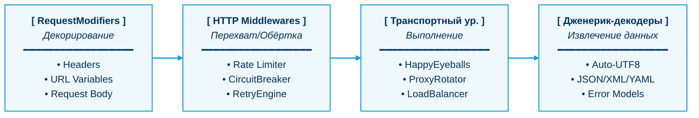

<div align="center">

# ❄️ aoni

### Ледяной движок отказоустойчивости для Go HTTP-сетей

[](https://pkg.go.dev/github.com/lemon4ksan/aoni)
[](https://goreportcard.com/report/github.com/lemon4ksan/aoni)
[](LICENSE)

> _«В сетях хаос — это состояние по умолчанию. Пусть aoni станет вашим ледяным якорем»._

#### 🇺🇸 [English](README.md) • 🇷🇺 [Русский](README_RU.md)

</div>

### Почему Aoni?

При интеграции с нестабильными API, парсинге (скрейпинге) или работе со сложными сетями прокси на Go стандартный клиент `net/http` часто требует написания большого количества шаблонного кода для решения таких практических задач, как ротация прокси, лимиты запросов (rate limits), устаревшие кодировки или фингерпринтинг TLS. 

`aoni` устраняет этот пробел. Библиотека представляет HTTP-запросы в виде конвейера, обрабатываемого декларативными **RequestModifiers** и стандартными **Middlewares** на Go, используя дженерики для строго типизированного декодирования ответов. Она остается непоколебимой под сетевой нагрузкой, прямо как синий они.

```shell
go get github.com/lemon4ksan/aoni
```

## 🎯 Когда использовать Aoni? (В отличие от обычных клиентов вроде Resty)

`aoni` не создавался для замены `net/http` или легковесных оберток вроде `resty` во внутренних корпоративных микросервисах, где требуется только чистая, линейная пропускная способность по прямому и стабильному сетевому каналу.

* **Выбирайте `net/http` / `resty`** для: Внутренних микросервисов, интеграций с надежными облачными API (AWS/S3, Stripe, Telegram) и стандартных высоконагруженных бэкендов, где вы полностью контролируете сеть и удаленный сервер.
* **Выбирайте `aoni`** для: Обхода систем глубокого анализа пакетов (DPI), парсинга сайтов с агрессивной защитой (Cloudflare, Akamai, Imperva), работы с неустойчивыми пулами прокси с липкими сессиями и реального времени на WebSockets поверх HTTP/2.

## 🌀 Философия конвейера (Pipeline)

В `aoni` запрос — это не статический объект, а непрерывный поток, обрабатываемый в четыре отдельных, высокооптимизированных этапа:



## ⚡ Контраст: стандартная библиотека против Aoni

Чтобы отправить JSON-запрос через отказоустойчивый пул прокси с повторными попытками и кастомной обработкой ошибок, при использовании стандартного Go потребуется вручную управлять циклами, приведением типов и писать громоздкую настройку транспорта. 

Сравнение двух подходов:

<table width="100%">
<tr>
<th width="50%">Стандартный <code>net/http</code> (Ручная настройка)</th>
<th width="50%">Использование <code>aoni</code> (Декларативный и отказоустойчивый)</th>
</tr>
<tr>
<td valign="top">

```go
// 🛑 Громоздкая, небезопасная работа с состоянием
transport := &http.Transport{
    Proxy: http.ProxyURL(proxyURL),
}
client := &http.Client{Transport: transport}

url := baseURL + "/users/" + strconv.FormatUint(id, 10)

var lastErr error
for i := 0; i < 3; i++ {
    req, _ := http.NewRequestWithContext(ctx, "GET", url, nil)
    resp, err := client.Do(req)
    if err != nil {
        lastErr = err
        time.Sleep(backoff)
        continue
    }
    defer resp.Body.Close()
    
    if resp.StatusCode != http.StatusOK {
        // Нужно вручную декодировать схему ошибки...
    }
    
    // Нужно вручную декодировать JSON...
    err = json.NewDecoder(resp.Body).Decode(&user)
    break
}
```

</td>
<td valign="top">

```go
// ❄️ Чистый, неизменяемый конвейерный поток
client := aoni.NewClient(transportChain)

user, err := aoni.GetJSON[User](ctx, client, "/users/{id}",
    aoni.WithVar("id", 123),
    aoni.WithErrorModel(&apiErr),
)
```

</td>
</tr>
</table>

## 📊 Матрица возможностей

Эта таблица показывает, на чем сфокусирован дизайн `aoni` по сравнению со стандартными возможностями Go и обычными обертками:

| Возможность / Функция | Go `net/http` | Стандартная обертка (например, Resty) | `aoni` |
| :--- | :---: | :---: | :---: |
| **Декорирование на базе дженериков** | ✗ (Вручную) | ✗ (На базе интерфейсов) | **✓ (Типобезопасное `[T]`)** |
| **Параллельное подключение «Happy Eyeballs»** | ⚠️ (Базовое) | ✗ | **✓ (RFC 8305)** |
| **Активный Circuit Breaking (Предохранитель)** | ✗ | ✗ | **✓ (Нативный Middleware)** |
| **Вежливый парсинг заголовка `Retry-After`** | ✗ | ✗ | **✓ (Delta-sec и RFC1123)** |
| **Преобразование кодировок, отличных от UTF-8** | ✗ | ✗ | **✓ (Автоматическое)** |
| **Обход TLS-фингерпринтинга (JA3)** | ✗ | ✗ | **✓ (через `uTLS` & Рукопожатие)** |
| **JA4+ Fingerprinting** | ✗ | ✗ | **✓ (TLS & HTTP, чистый Go)** |
| **Субмиллисекундная трассировка** | ⚠️ (Громоздкая) | ✗ | **✓ (В один модификатор)** |
| **Socket.IO / Engine.IO v4 клиент** | ✗ | ✗ | **✓ (Полная поддержка v5)** |

## 🍳 Рецепты: распространенные сценарии отказоустойчивости

Вместо сухого перечисления функций рассмотрим, как решать частые и раздражающие проблемы сетевого взаимодействия с помощью `aoni`.

### 1. Прозрачная ротация прокси с липкими сессиями (Sticky Sessions)
* **Проблема:** Вам нужно ротировать прокси для распределения нагрузки, но запросы конкретного пользователя должны идти через один и тот же адрес прокси, чтобы сохранить состояние его активной сессии.
* **Ледяное решение:**

```go
p1, _ := aoni.NewProxyClient(aoni.ProxyConfig{ProxyURL: "http://proxy1.local"})
p2, _ := aoni.NewProxyClient(aoni.ProxyConfig{ProxyURL: "http://proxy2.local"})

rotator, _ := aoni.NewProxyRotator(aoni.ProxyRotatorConfig{
    MaxFails:   3,
    RetryAfter: 30 * time.Second,
}, p1, p2)

// Динамически закрепляем прокси на основе куки сессии в запросе
stickyRotator := rotator.WithStickySessions(func(req *http.Request) string {
    if c, err := req.Cookie("sessionid"); err == nil {
        return c.Value
    }
    return ""
})

client := aoni.NewClient(aoni.Chain(stickyRotator, rateLimiter))
```

### 2. Снижение долгого хвоста задержек (Long-Tail Latency) с помощью хеджирования
* **Проблема:** Нестабильные прокси или перегруженные серверы время от времени зависают, задерживая всю очередь выполнения запросов.
* **Ледяное решение:** Если основной запрос зависает и не возвращает заголовки в течение 150 мс, параллельно отправляется резервный запрос. Возвращается результат того, который завершится быстрее.

```go
data, err := aoni.GetJSON[Data](ctx, aoni.NewClient(hedgedClient), "/data", WithHedging(10*time.Millisecond))
```

### 3. Автоматическое преобразование устаревших кодировок
* **Проблема:** Устаревшие региональные API или спарсенные сайты возвращают текст в старых кодировках (например, в кириллице или азиатских региональных кодировках), что приводит к появлению «кракозябр» при декодировании JSON.
* **Ледяное решение:** `aoni` на лету определяет кодировку из заголовков и прозрачно преобразует поток в стандартный UTF-8 перед передачей любому декодеру.

```go
manifest, err := aoni.GetJSON[Manifest](ctx, client, "/legacy-manifest",
    aoni.WithDownloadProgress(func(current, total int64) {
        fmt.Printf("Downloaded %d of %d bytes\n", current, total)
    }),
)
```

### 4. Современные способы обхода WAF и дактилоскопия JA4
* **Проблема:** Современные межсетевые экраны веб-приложений (WAF, такие как Cloudflare или Akamai) блокируют автоматические запросы на основе отпечатков TLS ClientHello (JA3/JA4) и порядка заголовков HTTP (JA4H).

* **Ледяное решение:** `aoni` эмулирует современные рукопожатия TLS в браузерах с использованием `uTLS` и автоматически выравнивает заголовки для генерации чистого, полностью совместимого с браузерами отпечатка. Встроенный подпакет [`ja4`](ja4/) обеспечивает вычисления JA4/JA4H на чистом Go.

```go
info := &aoni.TraceInfo{}

client := aoni.NewClient(nil).
    WithTLSFingerprint(aoni.BrowserChrome). // Подмена TLS ClientHello
    WithJA4Callback(func(r ja4.JA4Report) {
        fmt.Println("Active TLS Handshake JA4:", r.JA4)
    })

user, err := aoni.GetJSON[User](ctx, client, "/profile", 
    aoni.Trace(info), 
    aoni.TraceJA4(info), // Отслеживает отпечатки TLS (JA4) и HTTP (JA4H).
)

fmt.Println("Handshake TLS JA4:", info.JA4.JA4)   // "t13d1516h2_8daaf6152771_e5627efa2ab1"
fmt.Println("Request HTTP JA4H:", info.JA4.JA4H)  // "ge11nn03enus_9ed1ff1f7b03_cd8dafe26982"
```

### 5. Надежная потоковая передача данных в реальном времени через Socket.IO v5 / Engine.IO v4
* **Проблема:** Веб-сокеты реального времени на защищенных серверах блокируются во время установления соединения из-за стандартных отпечатков TLS Go, или незаметные разрывы TCP-соединения остаются незамеченными.

* **Решение:** `aoni` устанавливает полностью аутентифицированные, поддельные JA4, маршрутизируемые через прокси-сервер сессии Socket.IO v5 по стандартным WebSockets или скрытым туннелям HTTP/2 Extended CONNECT. Он включает в себя автоматическое, с дрожанием, переподключение и сигналы подтверждения таймаута пинга.

```go
cfg := aoni.SocketIOConfig{
		Reconnection: true,
		Namespace: "/realtime-prices",
		Auth: map[string]string{"token": "my-secure-token"},
}

// Автоматически наследует ротаторы прокси, защиту от DoT, JA4 и SSRF от клиента!
sio, err := aoni.DialSocketIO(ctx, client, "wss://api.pricedb.io", cfg)
if err != nil {
		log.Fatal(err)
}

sio.On("price_update", func(args []json.RawMessage) {
		var price Price
		_ = json.Unmarshal(args[0], &price)
		fmt.Printf("Live Price: %s -> %.2f\n", price.SKU, price.Value)
})
```

### 6. Диагностическая трассировка и автономная отладка
* **Проблема:** Отслеживание сетевых узких мест между прокси-серверами затруднительно, а воспроизведение неудачных запросов в терминале для ручной проверки занимает время.

* **Ледяное Решение:**

```go
var trace aoni.TraceInfo

aoni.GetJSON[User](ctx, client, "/debug",
    aoni.Trace(&trace), // Подробные метрики DNS, TCP и TLS.
    aoni.AsCurl(),      // Выводит эквивалентную исполняемую команду curl в стандартный поток ошибок
)

fmt.Printf("DNS: %s | TCP Connect: %s | TLS Handshake: %s | TTFB: %s\n",
    trace.DNSLookup, trace.TCPConn, trace.TLSHandshake, trace.ServerProcessing)
```

## 🎨 Потребление памяти и ресурсов

В то время как стандартные клиенты ориентированы только на чистую скорость, `aoni` спроектирован так, чтобы защитить ресурсы вашего приложения при масштабировании до тысяч конкурентных рабочих циклов:

* **Статический объем кучи (Heap):** Поддерживает минималистичный профиль в рантайме, потребляя всего около **~1.2 МБ** активной памяти кучи в состоянии покоя.
* **Переиспользование буферов через `sync.Pool`:** Использует пул слайсов памяти для потоковой передачи тела запроса, парсинга JSON и кодирования multipart-данных, чтобы свести к минимуму нагрузку на сборщик мусора (GC) и уменьшить паузы типа «stop-the-world».
* **Защита от утечек (Финализаторы):** Использует `runtime.SetFinalizer` для критически важных сетевых ответов, чтобы автоматически закрывать незакрытые соединения и предупреждать об утечках ресурсов до того, как закончатся файловые дескрипторы.
* **Защита от гигантских ответов («бомб»):** Применяет строгие лимиты на чтение полезной нагрузки (например, 10 МБ) через `io.LimitReader` для входящих ответов, предотвращая аварийное завершение работы из-за нехватки памяти (OOM) при получении вредоносных или неожиданно огромных ответов.

## ⚖️ Лицензия и правовая информация

Проект распространяется по лицензии **BSD 3-Clause License**. Подробности в файле [LICENSE](LICENSE).

<div align="center">
  <sub>Сохраняйте хладнокровие, оставайтесь непоколебимыми. Прямо как синий они.</sub>
</div>
