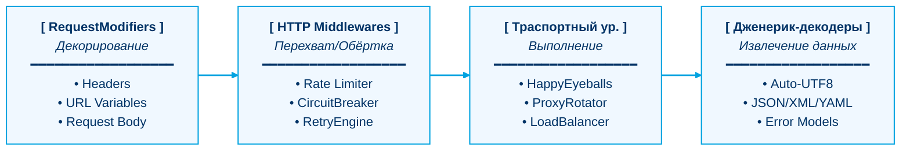

<div align="center">

# ❄️ aoni

### Ледяной движок отказоустойчивости для Go HTTP-сетей

[](https://pkg.go.dev/github.com/lemon4ksan/aoni)
[](https://goreportcard.com/report/github.com/lemon4ksan/aoni)
[](LICENSE)

> _«В сетях хаос - это состояние по умолчанию. Пусть aoni станет вашим ледяным якорем»._

#### 🇺🇸 [English](README.md) • 🇷🇺 [Русский](README_RU.md)

</div>

### Почему Aoni?

При интеграции с нестабильными API, парсинге, скрейпинге или работе со сложными сетями прокси на Go стандартный клиент `net/http` часто требует написания большого количества шаблонного кода для решения таких практических задач, как ротация прокси, лимиты запросов, устаревшие кодировки или фингерпринтинг TLS. 

`aoni` устраняет этот пробел. Библиотека представляет HTTP-запросы в виде конвейера, обрабатываемого декларативными **RequestModifiers** и стандартными **Middlewares** на Go, используя дженерики для строго типизированного декодирования ответов. Она остается непоколебимой под сетевой нагрузкой, прямо как синий они.

```shell
go get github.com/lemon4ksan/aoni
```

## 🎯 Когда использовать Aoni? (В отличие от обычных клиентов вроде Resty)

`aoni` не создавался для замены `net/http` или легковесных оберток вроде `resty` во внутренних корпоративных микросервисах, где требуется только чистая, линейная пропускная способность по прямому и стабильному сетевому каналу.

* **Выбирайте `net/http` / `resty`** для: Внутренних микросервисов, интеграций с надежными облачными API (AWS/S3, Stripe, Telegram) и стандартных высоконагруженных бэкендов, где вы полностью контролируете сеть и удаленный сервер.
* **Выбирайте `aoni`** для: Обхода систем глубокого анализа пакетов (DPI), парсинга сайтов с агрессивной защитой (Cloudflare, Akamai, Imperva), работы с неустойчивыми пулами прокси с липкими сессиями и реального времени на WebSockets поверх HTTP/2.

## 🌀 Философия конвейера (Pipeline)

В `aoni` запрос - это не статический объект, а непрерывный поток, обрабатываемый в четыре отдельных, высокооптимизированных этапа:


```mermaid
flowchart LR
    %% Styling
    classDef ice fill:#f0f8ff,stroke:#00a3e0,stroke-width:1.5px,color:#003366;
    linkStyle default stroke:#00a3e0,stroke-width:2px;
  
    p1["<b>[ RequestModifiers ]</b><br><i>Декорирование</i><br>━━━━━━━━━━━━━━━━━━<br>• Headers<br>• URL Variables<br>• Request Body"]:::ice
    p2["<b>[ HTTP Middlewares ]</b><br><i>Перехват/Обёртка</i><br>━━━━━━━━━━━━━━━━━━<br>• Rate Limiter<br>• CircuitBreaker<br>• RetryEngine"]:::ice
    p3["<b>[ Траспортный ур. ]</b><br><i>Выполнение</i><br>━━━━━━━━━━━━━━━━━━<br>• HappyEyeballs<br>• ProxyRotator<br>• LoadBalancer"]:::ice
    p4["<b>[ Дженерик-декодеры ]</b><br><i>Извлечение данных</i><br>━━━━━━━━━━━━━━━━━━<br>• Auto-UTF8<br>• JSON/XML/YAML<br>• Error Models"]:::ice
  
    p1 --> p2 --> p3 --> p4
```

## ⚡ Контраст: стандартная библиотека против Aoni

Чтобы отправить JSON-запрос через отказоустойчивый пул прокси с повторными попытками и кастомной обработкой ошибок, при использовании стандартного Go потребуется вручную управлять циклами, приведением типов и писать громоздкую настройку транспорта. 

Сравнение двух подходов:

<table width="100%">
<tr>
<th width="50%">Стандартный <code>net/http</code> (Ручная настройка)</th>
<th width="50%">Использование <code>aoni</code> (Декларативный и отказоустойчивый)</th>
</tr>
<tr>
<td valign="top">

```go
// 🛑 Громоздкая, небезопасная работа с состоянием
transport := &http.Transport{
    Proxy: http.ProxyURL(proxyURL),
}
client := &http.Client{Transport: transport}

url := baseURL + "/users/" + strconv.FormatUint(id, 10)

var lastErr error
for i := 0; i < 3; i++ {
    req, _ := http.NewRequestWithContext(ctx, "GET", url, nil)
    resp, err := client.Do(req)
    if err != nil {
        lastErr = err
        time.Sleep(backoff)
        continue
    }
    defer resp.Body.Close()
    
    if resp.StatusCode != http.StatusOK {
        // Нужно вручную декодировать схему ошибки...
    }
    
    // Нужно вручную декодировать JSON...
    err = json.NewDecoder(resp.Body).Decode(&user)
    break
}
```

</td>
<td valign="top">

```go
// ❄️ Чистый, неизменяемый конвейерный поток
client := aoni.NewClient(transportChain)

// 1. Автоматическое получение структурированного JSON
user, err := aoni.GetTo[User](ctx, client, "/users/{id}",
    aoni.WithVar("id", 123),
    aoni.WithErrorModel(&apiErr),
)

// 2. Или выполнение сырых HTTP-запросов напрямую через удобные методы клиента
resp, err := client.Get(ctx, "/raw-data")
```

</td>
</tr>
</table>

## 🧱 Кастомные Middleware и настройка конвейера

`aoni` использует модульную архитектуру конвейера (pipeline). Основной процесс выполнения запроса клиентом состоит из 12 независимых стандартных middleware на Go, обернутых вокруг сырого HTTP-движка.

### Кастомная обертка конвейера
Вы можете настроить, переупорядочить или полностью заменить стандартную цепочку middleware с помощью `WithPipelineWrapper`:

```go
client := aoni.NewClient(nil).
	WithPipelineWrapper(func(c *aoni.Client, engine aoni.HTTPDoer) aoni.HTTPDoer {
		// Создайте свой собственный конвейер, внедряя кастомную логику или меняя этапы местами
		return aoni.Chain(engine,
			aoni.InspectorMiddleware(c.Inspector()),
			aoni.ResponseValidationMiddleware(),
		)
	})
```

### Специализированные встроенные Middleware
Помимо внутренних базовых middleware, `aoni` предоставляет 6 специализированных middleware для продвинутого обхода блокировок, отказоустойчивости и аудита:

1. **`UserAgentAndHintsRotationMiddleware`** (Скрытность и обход блокировок)
   Согласованно ротирует `User-Agent` и соответствующие ему Client Hints (`Sec-CH-UA-*`) для каждого запроса, предотвращая несоответствия в отпечатках браузера.
2. **`DPIJitterMiddleware`** (Скрытность и обход блокировок)
   Добавляет рандомизированную задержку (jitter) между отправкой заголовков запроса и его тела, мешая анализу таймингов системами глубокого анализа пакетов (DPI).
3. **`ProxyFailoverMiddleware`** (Отказоустойчивость)
   Прозрачно переключает прокси-серверы из заданного пула и повторяет попытку выполнения запроса, если основной прокси завершился ошибкой соединения или вернул статус `502`/`503`.
4. **`CacheMiddleware`** (Производительность и отказоустойчивость)
   HTTP-кэш, совместимый с RFC-7234, для `GET`-запросов. Сохраняет ответы в потокобезопасное хранилище `InMemoryCacheStore` или кастомный бэкенд `CacheStore`.
5. **`SensitiveDataRedactorMiddleware`** (Безопасность и аудит)
   Маскирует конфиденциальные заголовки (например, `Authorization`, `Cookie`) в контексте запроса перед их передачей в `TrafficInspector` или логгеры, заменяя значения на `[REDACTED]`.
6. **`HARGeneratorMiddleware`** (Аудит)
   Фиксирует полные обмены данными между клиентом и сервером (включая тайминги и тела ответов) в объект `HARGenerator` для экспорта в стандартный формат логов HTTP Archive (HAR) JSON.

## 📊 Матрица возможностей

Эта таблица показывает, на чем сфокусирован дизайн `aoni` по сравнению со стандартными возможностями Go и обычными обертками:

| Возможность / Функция | Go `net/http` | Стандартная обертка (например, Resty) | `aoni` |
| :--- | :---: | :---: | :---: |
| **Декорирование на базе дженериков** | ✗ (Вручную) | ✗ (На базе интерфейсов) | **✓ (Типобезопасное `[T]`)** |
| **Параллельное подключение «Happy Eyeballs»** | ⚠️ (Базовое) | ✗ | **✓ (RFC 8305)** |
| **Активный Circuit Breaking (Предохранитель)** | ✗ | ✗ | **✓ (Нативный Middleware)** |
| **Вежливый парсинг заголовка `Retry-After`** | ✗ | ✗ | **✓ (Delta-sec и RFC1123)** |
| **Преобразование кодировок, отличных от UTF-8** | ✗ | ✗ | **✓ (Автоматическое)** |
| **Обход TLS-фингерпринтинга (JA3/JA4)** | ✗ | ✗ | **✓ (через `uTLS` & Рукопожатие)** |
| **JA4+ Fingerprinting** | ✗ | ✗ | **✓ (TLS & HTTP, чистый Go)** |
| **Субмиллисекундная трассировка** | ⚠️ (Громоздкая) | ✗ | **✓ (В один модификатор)** |
| **Структурированное распаковывание ответов** | ✗ | ✗ | **✓ (`WithBaseResponse`)** |
| **Socket.IO / Engine.IO v4 клиент** | ✗ | ✗ | **✓ (Полная поддержка v5)** |
| **Точечные переопределения (Overrides)** | ✗ (Ручной транспорт) | ✗ (Требует клонирования клиента) | **✓ (Контекстные аксессоры)** |

## 🛠️ Двухуровневая конфигурация (Переопределения)

`aoni` реализует удобную двухуровневую модель конфигурации, позволяя задавать глобальные дефолтные настройки для всего клиента и переопределять их точечно для индивидуальных запросов без создания нового `Client`.

```
Контекст (Per-Request Option) -> Настройка клиента (Client-level Default) -> Окружение (System Default)
```

* **Глобальный уровень (Настроил раз):** Параметры задаются на уровне клиента. Любой вызов `With*` на `*Client` возвращает неизменяемую потокобезопасную копию клиента.
* **Локальный уровень (Переопределил для вызова):** Параметры передаются через контекст конкретного запроса с помощью `RequestModifier` в функциях вызова HTTP.

### Матрица поддержки переопределений

| Параметр | Глобальный метод (Client-Level) | Локальный модификатор (Per-Request) | Приоритет разрешения настроек |
| :--- | :--- | :--- | :--- |
| **Прокси (Proxy)** | `client.WithProxy(url)` | `aoni.WithProxyOverride(url)` | Локальный -> Глобальный -> Системные переменные (`HTTP_PROXY`) |
| **Игнорирование TLS** | `client.WithInsecureSkipVerify()` | `aoni.WithInsecureSkipVerify()` | Локальный -> Глобальный -> Стандартная TLS-валидация |
| **Задержка TCP** | `client.WithTCPDelay(min, max)` | `aoni.WithTCPDelay(min, max)` | Локальный -> Глобальный -> Без задержки |
| **Валидация ответов** | `client.WithResponseValidator(fn)` | `aoni.WithResponseValidator(fn)` | Вызываются последовательно. Ошибка локального перекрывает глобальный. |
| **Ретраи (Retry)** | *Автоматически в middleware* | `aoni.WithRetryPolicy(override)` | Локальный `RetryOverride` полностью заменяет настройки глобального Middleware. |
| **Время кэша (TTL)** | *Определяется в middleware* | `aoni.WithCacheTTL(duration)` | Пробрасывается через контекст для чтения кэширующим Middleware. |
| **Метаданные (Metadata)** | *Отсутствует* | `aoni.WithConnMetadata(key, val)` | Потокобезопасные теги запроса, доступные в логах и транспорте. |

## 🍳 Рецепты: распространенные сценарии отказоустойчивости

Вместо сухого перечисления функций рассмотрим, как решать частые и раздражающие проблемы сетевого взаимодействия с помощью `aoni`.

### 1. Прозрачная ротация прокси с липкими сессиями (Sticky Sessions)
* **Проблема:** Вам нужно ротировать прокси для распределения нагрузки, но запросы конкретного пользователя должны идти через один и тот же адрес прокси, чтобы сохранить состояние его активной сессии.
* **Ледяное решение:**

```go
p1, _ := aoni.NewProxyClient(aoni.ProxyConfig{ProxyURL: "http://proxy1.local"})
p2, _ := aoni.NewProxyClient(aoni.ProxyConfig{ProxyURL: "http://proxy2.local"})

rotator, _ := aoni.NewProxyRotator(aoni.ProxyRotatorConfig{
    MaxFails:   3,
    RetryAfter: 30 * time.Second,
}, p1, p2)

// Динамически закрепляем прокси на основе куки сессии в запросе
stickyRotator := rotator.WithStickySessions(func(req *http.Request) string {
    if c, err := req.Cookie("sessionid"); err == nil {
        return c.Value
    }
    return ""
})

client := aoni.NewClient(aoni.Chain(stickyRotator, rateLimiter))
```

### 2. Точечная настройка транспорта для конкретного запроса (Паттерн переопределений)
* **Проблема:** У вас есть преднастроенный клиент, но для одного конкретного тяжелого запроса требуется обойти проверку сертификатов, пойти через премиальный прокси и добавить задержку соединения, чтобы избежать блокировки.
* **Ледяное решение:** Передайте соответствующие модификаторы непосредственно в вызов метода запроса. Все остальные запросы клиента останутся нетронутыми и безопасными.

```go
resp, err := client.Get(ctx, "/premium-endpoint",
    aoni.WithProxyOverride("http://premium-proxy.com:8080"),
    aoni.WithInsecureSkipVerify(),
    aoni.WithTCPDelay(100*time.Millisecond, 500*time.Millisecond),
)
```

### 3. Снижение долгого хвоста задержек (Long-Tail Latency) с помощью хеджирования
* **Проблема:** Нестабильные прокси или перегруженные серверы время от времени зависают, задерживая всю очередь выполнения запросов.
* **Ледяное решение:** Если основной запрос зависает и не возвращает заголовки в течение 150 мс, параллельно отправляется резервный запрос. Возвращается результат того, который завершится быстрее.

```go
data, err := aoni.GetTo[Data](ctx, aoni.NewClient(hedgedClient), "/data", WithHedging(10*time.Millisecond))
```

### 4. Автоматическое преобразование устаревших кодировок
* **Проблема:** Устаревшие региональные API или спарсенные сайты возвращают текст в старых кодировках (например, в кириллице или азиатских региональных кодировках), что приводит к появлению «кракозябр» при декодировании JSON.
* **Ледяное решение:** `aoni` на лету определяет кодировку из заголовков и прозрачно преобразует поток в стандартный UTF-8 перед передачей любому декодеру.

```go
manifest, err := aoni.GetTo[Manifest](ctx, client, "/legacy-manifest",
    aoni.WithDownloadProgress(func(current, total int64) {
        fmt.Printf("Downloaded %d of %d bytes\n", current, total)
    }),
)
```

### 5. Современные способы обхода WAF и дактилоскопия JA4
* **Проблема:** Современные межсетевые экраны веб-приложений (WAF, такие как Cloudflare или Akamai) блокируют автоматические запросы на основе отпечатков TLS ClientHello (JA3/JA4) и порядка заголовков HTTP (JA4H).
* **Ледяное решение:** `aoni` эмулирует современные рукопожатия TLS в браузерах с использованием `uTLS` и автоматически выравнивает заголовки для генерации чистого, полностью совместимого с браузерами отпечатка. Встроенный подпакет [`ja4`](ja4/) обеспечивает вычисления JA4/JA4H на чистом Go.

```go
info := &aoni.TraceInfo{}

client := aoni.NewClient(nil).
    WithTLSFingerprint(aoni.BrowserChrome). // Подмена TLS ClientHello
    WithJA4Callback(func(r ja4.JA4Report) {
        fmt.Println("Active TLS Handshake JA4:", r.JA4)
    })

user, err := aoni.GetTo[User](ctx, client, "/profile", 
    aoni.Trace(info), 
    aoni.TraceJA4(info), // Отслеживает отпечатки TLS (JA4) и HTTP (JA4H).
)

fmt.Println("Handshake TLS JA4:", info.JA4.JA4)   // "t13d1516h2_8daaf6152771_e5627efa2ab1"
fmt.Println("Request HTTP JA4H:", info.JA4.JA4H)  // "ge11nn03enus_9ed1ff1f7b03_cd8dafe26982"
```

### 6. Надежная потоковая передача данных в реальном времени через Socket.IO v5 / Engine.IO v4
* **Проблема:** Веб-сокеты реального времени на защищенных серверах блокируются во время установления соединения из-за стандартных отпечатков TLS Go, или незаметные разрывы TCP-соединения остаются незамеченными.
* **Решение:** `aoni` устанавливает полностью аутентифицированные, поддельные JA4, маршрутизируемые через прокси-сервер сессии Socket.IO v5 по стандартным WebSockets или скрытым туннелям HTTP/2 Extended CONNECT tunnels. Он включает в себя автоматическое, с дрожанием, переподключение и сигналы подтверждения таймаута пинга.

```go
cfg := aoni.SocketIOConfig{
		Reconnection: true,
		Namespace: "/realtime-prices",
		Auth: map[string]string{"token": "my-secure-token"},
}

// Автоматически наследует ротаторы прокси, защиту от DoT, JA4 и SSRF от клиента!
sio, err := aoni.DialSocketIO(ctx, client, "wss://api.pricedb.io", cfg)
if err != nil {
		log.Fatal(err)
}

sio.On("price_update", func(args []json.RawMessage) {
		var price Price
		_ = json.Unmarshal(args[0], &price)
		fmt.Printf("Live Price: %s -> %.2f\n", price.SKU, price.Value)
})
```

### 7. Диагностическая трассировка и автономная отладка
* **Проблема:** Отслеживание сетевых узких мест между прокси-серверами затруднительно, а воспроизведение неудачных запросов в терминале для ручной проверки занимает время.
* **Ледяное Решение:**

```go
var trace aoni.TraceInfo

aoni.GetTo[User](ctx, client, "/debug",
    aoni.Trace(&trace), // Подробные метрики DNS, TCP и TLS.
    aoni.AsCurl(),      // Выводит эквивалентную исполняемую команду curl в стандартный поток ошибок
)

fmt.Printf("DNS: %s | TCP Connect: %s | TLS Handshake: %s | TTFB: %s\n",
    trace.DNSLookup, trace.TCPConn, trace.TLSHandshake, trace.ServerProcessing)
```

### 8. Структурированное распаковывание ответов API с помощью `WithBaseResponse`
* **Проблема:** Многие API оборачивают данные в конверт (envelope): `{"success":true,"data":{...}}` или `{"status":"ok","result":{...}}`. Ручное распаковывание таких конвертов, проверка флагов успеха и извлечение ошибок - это повторяющийся шаблонный код.
* **Ледяное решение:** Реализуйте интерфейс `BaseResponse` (`IsSuccess`, `Error`, `SetData`, `UnmarshalJSON`) и настройте клиент через `WithBaseResponse`. Декодер автоматически декодирует в вашу обёртку, проверяет флаг успеха, извлекает ошибки и распаковывает вложенные данные - всё за один проход.

```go
// 1. Определяем обёртку (envelope)
type apiResponse struct {
	Success bool            `json:"success"`
	Message string          `json:"message,omitempty"`
	Data    json.RawMessage `json:"data,omitempty"` // Захватываем сырой кусок JSON
	target  any
}

func (r *apiResponse) IsSuccess() bool  { return r.Success }
func (r *apiResponse) Error() error     { return errors.New(r.Message) }
func (r *apiResponse) SetData(data any) { r.target = data }

func (r *apiResponse) UnmarshalJSON(data []byte) error {
	// 1. Избегаем рекурсии, используя алиас
	type Alias apiResponse
	var aux Alias
	if err := json.Unmarshal(data, &aux); err != nil {
		return err
	}
	
	r.Success = aux.Success
	r.Message = aux.Message
	r.Data = aux.Data // Сохраняем сырые данные из поля "data"

	// 2. Декодируем только содержимое поля "data" в наш целевой объект
	if r.target != nil && len(r.Data) > 0 {
		return json.Unmarshal(r.Data, r.target)
	}
	return nil
}

// 2. Настраиваем клиент - каждый JSON-запрос проходит через эту обёртку
client := aoni.NewClient(nil).
	WithBaseURL("https://api.example.com").
	WithBaseResponse(func() aoni.BaseResponse { return &apiResponse{} })

// 3. Используем - декодер автоматически распаковывает конверт
user, err := aoni.GetTo[User](ctx, client, "/users/1")
// Если API вернул {"success":false,"message":"not found"}, err != nil
// Если API вернул {"success":true,"data":{"name":"Alice"}}, user.Name == "Alice"
```

## 🎨 Потребление памяти и ресурсов

В то время как стандартные клиенты ориентированы только на чистую скорость, `aoni` спроектирован так, чтобы защитить ресурсы вашего приложения при масштабировании до тысяч конкурентных рабочих циклов:

* **Статический объем кучи (Heap):** Поддерживает минималистичный профиль в рантайме, потребляя всего около **~1.2 МБ** активной памяти кучи в состоянии покоя.
* **Переиспользование буферов через `sync.Pool`:** Использует пул слайсов памяти для потоковой передачи тела запроса, парсинга JSON и кодирования multipart-данных, чтобы свести к минимуму нагрузку на сборщик мусора (GC) и уменьшить паузы типа «stop-the-world».
* **Защита от утечек (Финализаторы):** Использует `runtime.SetFinalizer` для критически важных сетевых ответов, чтобы автоматически закрывать незакрытые соединения и предупреждать об утечках ресурсов до того, как закончатся файловые дескрипторы.
* **Защита от гигантских ответов («бомб»):** Применяет строгие лимиты на чтение полезной нагрузки (например, 10 МБ) через `io.LimitReader` для входящих ответов, предотвращая аварийное завершение работы из-за нехватки памяти (OOM) при получении вредоносных или неожиданно огромных ответов.

## ⚖️ Лицензия и правовая информация

Проект распространяется по лицензии **BSD 3-Clause License**. Подробности в файле [LICENSE](LICENSE).

<div align="center">
  <sub>Сохраняйте хладнокровие, оставайтесь непоколебимыми. Прямо как синий они.</sub>
</div>
