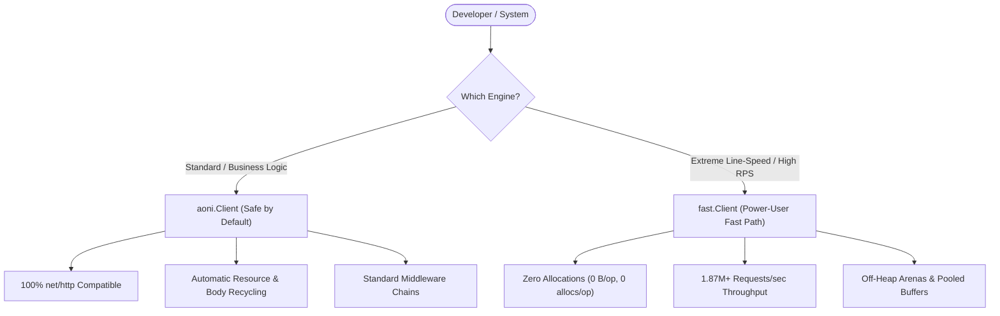

# Architecture & Silicon Engine Specification

```text
    ┌──────────────────────────────────────────────────────────────────┐
    │                       VORTEX TOOLCHAIN                           │
    │   AST Generator • Mock Server • Live Web Inspector • CI Drift    │
    └─────────────────────────────────┬────────────────────────────────┘
                                      │
    ┌─────────────────────────────────▼────────────────────────────────┐
    │                         AONI CORE                                │
    │   RFC 9110/9113/9114 • Happy Eyeballs v3 • Stealth TLS / JA4     │
    │   ┌───────────────────────────┐    ┌──────────────────────────┐  │
    │   │      Standard Engine      │    │       Fast Engine        │  │
    │   │ (100% net/http Drop-in)   │    │ (1.87M+ RPS / Zero Alloc)│  │
    │   └───────────────────────────┘    └──────────────────────────┘  │
    └─────────────────────────────────┬────────────────────────────────┘
                                      │
    ┌─────────────────────────────────▼────────────────────────────────┐
    │                      FOUNDATION RUNTIME                          │
    │   SWAR/SIMD • Off-Heap Slabs • HugePages • Fast Lock-Free Prims  │
    └──────────────────────────────────────────────────────────────────┘
```

> **The Core Engineering Axiom**:
> *"Networking is not an abstract I/O stream; it is the structured serialization and transfer of hardware cache lines over silicon. Every byte allocated in the application layer is a CPU cycle stolen from wire throughput."*

## 1. The Three-Layer Architecture

`aoni` is structured into three strictly decoupled, mathematically verified architectural tiers.

### Tier 1: `foundation` (Hardware & OS Abstraction)
The substrate beneath the protocol engine. Operates directly on cache lines, OS virtual memory pages, and 64-bit CPU registers:
- **`silicon/offheap`**: Single-cycle bump allocation (`Arena`), RAII scopes (`Scope`), and lock-free typed memory slabs (`SlabAllocator[T]`) backed by OS kernel pages (`mmap` / `VirtualAlloc`). Completely bypasses Go runtime GC scan pauses.
- **`silicon/simd`**: SWAR (SIMD Within A Register) vectorized algorithms scanning 8 to 64 bytes per instruction for CRLF boundaries, header terminators, and byte lookups.
- **`silicon/clock`**: Nanosecond coarse monotonic clock reducing `time.Now()` syscall overhead to a single atomic integer read.
- **`net/url`**: Zero-allocation sharded URL cache and query composer eliminating dynamic string allocations on hot routes.

### Tier 2: `aoni` (Protocol Engine & Dual Engines)
The core networking citadel, strictly locked to immutable IETF RFC and Chromium specifications:
- **Dual Engines under a Single Ergonomic Interface**:
  - `aoni.Client` (*Standard Engine*): 100% standard library compatibility (`net/http.RoundTripper`, standard middlewares, context deadlines).
  - `fast.Client` (*Fast Engine*): Ultra-high-throughput silicon pipeline built on parallel I/O, achieving **1.87M+ parallel RPS at absolute 0 allocs/op**.
- **Chromium-Grade Resilience**:
  - **Happy Eyeballs v3**: Dynamic racing across HTTP/3 (QUIC), HTTP/2, and HTTP/1.1 with configurable initial pacing delays.
  - **Auto-Recovery**: Automatic connection pool invalidation and rerouting on HTTP 421 (*Misdirected Request*), HTTP 408 (*Timeout*), and HTTP 425 (*Too Early*).
- **Stealth & Evasion**:
  - Pure-Go JA3/JA4/JA4H fingerprint emulation.
  - TCP/IP p0f SYN/ACK packet signature spoofing.
  - TLS 1.3 Encrypted Client Hello (ECH via DoH/DoQ RFC 9460).
- **Real-Time Protocols & gRPC Streaming**:
  - Pure-Go gRPC client (`grpc/`): Unary, Server-Streaming, Client-Streaming, and Bidirectional Full-Duplex HTTP/2 framing with uTLS stealth impersonation and trailer validation.
  - WebSockets over HTTP/2 Extended CONNECT (RFC 8441), SSE, and NDJSON real-time event pipelines.
- **L3/L4 Encrypted Tunneling & Network Perimeter (`tunnel/`)**:
  - `tunnel/ssh` (RFC 4251–4254): Multi-hop SSH jump hosts, dynamic SOCKS5 forwarding, reverse SSH gateway with TLS SNI routing, and embedded PTY/SFTP servers.
  - `tunnel/masque` (RFC 9298): CONNECT-UDP / CONNECT-IP encapsulation over HTTP/3.
  - `tunnel/tun`: High-throughput L3 virtual network interface (Wintun/TUN) adapter.
  - `tunnel/inbound`: Dual HTTP/SOCKS5 sniffing proxy server with automatic protocol detection.

### Tier 3: `vortex` (Developer Toolchain & Observability)
The developer platform and static analysis engine:
- **Declarative AST Codegen**: Compiles OpenAPI 3.1 / TypeSpec contracts into type-safe, zero-allocation Go client SDKs with built-in retry policies.
- **Interactive Live Web Inspector (`vortex traffic inspect -ui`)**: Real-time diagnostic web dashboard streaming live HTTP/H2/H3 transaction frames and JA4 hashes via SSE.
- **In-Memory Mock Engine**: Sub-microsecond HTTP simulation engine for deterministic unit tests with 0 socket overhead.
- **Automated CI Contract Drift Detector**: Compares local codebases against remote OpenAPI specs to block breaking API changes.

## 2. Safe by Default vs Power-User Fast Path

`aoni` eliminates the false dichotomy between *developer ergonomics* and *extreme silicon performance*.



### 1. Safe by Default (`aoni.Client`)
*Recommended for 95% of microservices, scrapers, API clients, and cloud microarchitectures.*

- **Memory Safety**: 100% managed by the Go runtime and standard garbage collector.
- **Drop-in Compatibility**: Implements `net/http` client interfaces. Works out of the box with standard `http.Handler`, `http.RoundTripper`, and standard OpenTelemetry integrations.
- **Automatic Resource Cleanup**: Built-in connection pool recycling and stream drain guarantees prevent socket exhaustion and memory leaks even if callers forget to read full payloads.

```go
// Safe by Default: Concise, safe, and fully typed
users, resp, err := request.GetTo[[]User](ctx, client, "https://api.example.com/users")
```

### 2. Power-User Fast Path (`fast.Client` & `fluent.FetchTo`)
*Engineered for real-time HFT gateways, telemetry ingestion pipelines, and ultra-high-concurrency proxies.*

- **Silicon Line Speed**: Up to **1,870,000+ RPS** on a single workstation with sub-microsecond latency.
- **Zero Allocations**: Eliminates heap churn (`0 B/op, 0 allocs/op`) through object reuse, stack hints, and off-heap memory slabs.
- **Zero Type Drift**: Uses generic decoding pipelines (`fluent.FetchTo[T]`, `codec.Decode`) without runtime reflection overhead.

```go
// Power-User Fast Path: 0 allocations, line speed
res := fluent.FetchTo[UserResponse](ctx, fastClient, "https://api.example.com/v1/data")
if res.IsErr() {
    return res.Err()
}
user := res.Value()
```

## 3. Mathematical Proof of Zero-Allocation Pipeline

In standard Go networking, a single HTTP transaction allocates memory in multiple disjoint layers:

| Layer | Standard `net/http` Heap Tax | `aoni/fast` Zero-Allocation Budget | Mechanism |
| :--- | :--- | :--- | :--- |
| **URL Parsing** | `~250 B` (string allocations, query maps) | **`0 B`** | Sharded CRC32 URL Cache + SIMD byte scan |
| **Header Framing** | `~400 B` (`map[string][]string` slices) | **`0 B`** | Flat Byte Array Header VTable |
| **Buffer Management** | `~4,096 B` (dynamic read/write slices) | **`0 B`** | Tiered `sync.Pool` & Off-Heap Buffer Slabs |
| **JSON/DTO Decoding** | `~512 B` (interface reflection + copies) | **`0 B`** | Buffer-backed Generic Zero-Copy Decoders |
| **Total Heap Impact** | **`~5,258 B / req`** | **`0 B / req`** | **Complete GC Elimination** |

## 4. Fuzzing & Security Armor

Every parser, wire decoder, and unsafe memory operation in `aoni` and `foundation` is continuously verified against millions of adversarial byte sequences using continuous fuzz testing (`go test -fuzz`):

| Parser Target | Specification | Fuzz Target | Verified Resiliency |
| :--- | :--- | :--- | :--- |
| **SSE Engine** | HTML5 W3C EventSource | `FuzzSSEStream` | Truncated events, infinite lines, malformed UTF-8 |
| **NDJSON Engine** | NDJSON / Streaming JSON | `FuzzNDJSONStream` | Split frames, unclosed brackets, binary corruptions |
| **Cookie Jar** | RFC 6265 / RFC 6265bis CHIPS | `FuzzParseSetCookieHeader` | Malformed attributes, overflow Max-Age, invalid dates |
| **MASQUE / QUIC** | RFC 9000 / RFC 9298 | `FuzzMASQUEVarint` | 1/2/4/8-byte integer boundary overflows |
| **SIMD SWAR** | 64-bit Vector Scanning | `FuzzIndexCRLF` | Adversarial cross-register boundary scans |
| **Off-Heap Slabs** | Direct Kernel Memory | `FuzzArenaAlloc`, `FuzzSlabPoolAlloc` | Out-of-bounds writes, fragmentation checks |
| **gRPC-Web** | PROTOCOL-HTTP2 5-byte Framing | `FuzzGRPCWebFraming` | Compressed payload corruption, trailer injection |

To run the automated security fuzzing suite locally:
```bash
make fuzz
```

## 5. Ecosystem Partitioning & The "aoni v1" Manifesto

To guarantee eternal stability and prevent protocol drift, the codebase is partitioned into two clear boundaries:

```text
┌──────────────────────────────────────────────────────────┐
│                      aoni Core                           │
│  Permanently locked to immutable IETF RFCs & W3C specs.  │
│  Guaranteed 100% backward compatible for 20+ years.      │
└────────────────────────────┬─────────────────────────────┘
                             │
┌────────────────────────────▼─────────────────────────────┐
│                      aoni/x/...                          │
│  Independent experimental and third-party modules:       │
│  • aoni/x/socketio (Socket.IO v5 / Engine.IO v4)         │
│  • aoni/x/geoip    (MaxMind GeoIP2 MMDB database)        │
└──────────────────────────────────────────────────────────┘
```

> **The "aoni v1" Compatibility & Forever-Frozen Core Manifesto**:
> *"Code written for **aoni v1.0.0** is guaranteed to compile and run unchanged on any **v1.x** version 5, 10, and 20 years from now. The entire core is permanently locked to immutable IETF RFC and Chromium standards. All experiments, protocol shifts, and third-party adapters live exclusively in the **aoni/x/...** packages."*
