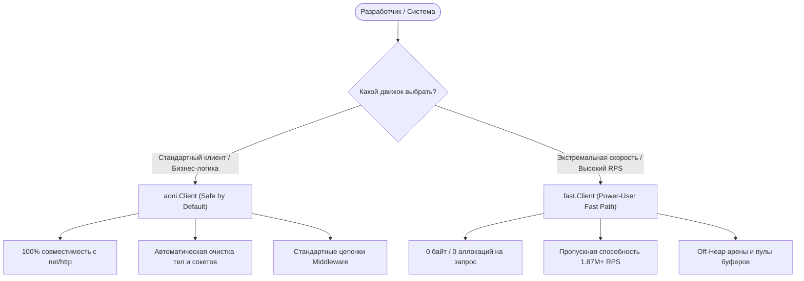

# Архитектура и спецификация кремниевого движка aoni

```text
    ┌──────────────────────────────────────────────────────────────────┐
    │                          VORTEX TOOLCHAIN                        │
    │   AST Генератор • Mock Сервер • Web Инспектор • CI Drift-контроль│
    └─────────────────────────────────┬────────────────────────────────┘
                                      │
    ┌─────────────────────────────────▼────────────────────────────────┐
    │                             AONI CORE                            │
    │   RFC 9110/9113/9114 • Happy Eyeballs v3 • Stealth TLS / JA4     │
    │   ┌───────────────────────────┐    ┌──────────────────────────┐  │
    │   │      Standard Engine      │    │       Fast Engine        │  │
    │   │ (100% net/http Drop-in)   │    │ (1.87M+ RPS / Zero Alloc)│  │
    │   └───────────────────────────┘    └──────────────────────────┘  │
    └─────────────────────────────────┬────────────────────────────────┘
                                      │
    ┌─────────────────────────────────▼────────────────────────────────┐
    │                         FOUNDATION RUNTIME                       │
    │   SWAR/SIMD • Off-Heap Slabs • HugePages • Быстрые примитивы     │
    └──────────────────────────────────────────────────────────────────┘
```

> **Главная инженерная аксиома**:
> *«Сетевой стек — это не абстрактный поток ввода-вывода; это структурированная сериализация и передача строк кэша процессора по кремнию. Каждый байт, аллоцированный на уровне приложения — это такты CPU, украденные у пропускной способности сети.»*

## 1. Трёхуровневая архитектура

`aoni` разделена на три строго изолированных, математически выверенных уровня.

### Уровень 1: `foundation` (Абстракция кремния и ОС)
Фундамент под протокольным движком. Работает напрямую со строками кэша L1/L2, страницами виртуальной памяти ОС и 64-битными регистрами процессора:
- **`silicon/offheap`**: Однотактная bump-аллокация указателей (`Arena`), RAII-области видимости (`Scope`) и lock-free типизированные пулы памяти (`SlabAllocator[T]`), выделяемые напрямую через системные вызовы ядра (`mmap` / `VirtualAlloc`). Полностью исключает паузы сборщика мусора (GC) Go.
- **`silicon/simd`**: Векторные алгоритмы SWAR (SIMD Within A Register), сканирующие от 8 до 64 байт за одну инструкцию для поиска границ CRLF, заголовков и байтовых маркеров.
- **`silicon/clock`**: Грубые монотонные наносекундные часы, сводящие оверхед системного вызова `time.Now()` к атомарному чтению 64-битного целого числа.
- **`net/url`**: Шардированный кэш URL с нулевыми аллокациями и сборщик query-параметров на основе CRC32.

### Уровень 2: `aoni` (Протокольный движок и два типа клиентов)
Сетевая цитадель ядра, навсегда зафиксированная в стандартах IETF RFC и поведении Chromium:
- **Два движка под единым эргономичным интерфейсом**:
  - `aoni.Client` (*Стандартный движок*): 100% совместимость со стандартной библиотекой (`net/http.RoundTripper`, цепочки middleware, контекстные таймауты).
  - `fast.Client` (*Быстрый движок*): Высокопроизводительный кремниевый конвейер на параллельном вводе-выводе, достигающий **1.87M+ RPS при абсолютных 0 аллокациях**.
- **Устойчивость уровня Chromium**:
  - **Happy Eyeballs v3**: Динамическая гонка протоколов HTTP/3 (QUIC), HTTP/2 и HTTP/1.1 с настраиваемыми задержками пейсинга.
  - **Автоматическое восстановление**: Мгновенная инвалидация пула соединений и перемаршрутизация при кодах HTTP 421 (*Misdirected Request*), HTTP 408 (*Timeout*) и HTTP 425 (*Too Early*).
- **Маскировка и обход WAF (Stealth)**:
  - Pure-Go эмуляция отпечатков JA3, JA4 и JA4H.
  - Подмена сигнатур TCP/IP стека на уровне SYN/ACK пакетов (p0f).
  - TLS 1.3 Encrypted Client Hello (ECH по стандарту RFC 9460 через DoH/DoQ).
- **Протоколы реального времени и gRPC-стриминг**:
  - Чистый Go gRPC-клиент (`grpc/`): Unary, Server-Streaming, Client-Streaming и полнодуплексный Bidirectional Streaming фрейминг поверх HTTP/2 с маскировкой uTLS и валидацией трейлеров.
  - WebSockets поверх HTTP/2 Extended CONNECT (RFC 8441), SSE и NDJSON потоки событий.
- **L3/L4 шифрованное туннелирование и периметр сети (`tunnel/`)**:
  - `tunnel/ssh` (RFC 4251–4254): Multi-hop SSH бастионы (Jump Hosts), динамический SOCKS5 форвардинг, обратный SSH шлюз с маршрутизацией по TLS SNI, а также встраиваемые PTY и SFTP серверы.
  - `tunnel/masque` (RFC 9298): Инкапсуляция CONNECT-UDP и CONNECT-IP поверх HTTP/3.
  - `tunnel/tun`: Универсальный интерфейс L3 сетевого адаптера (драйверы ОС в `aoni/x/tunnel/tun`).
  - `tunnel/inbound`: Двойной гибридный HTTP/SOCKS5 прокси-сервер с авто-определением протокола.

### Уровень 3: `vortex` (Инструментарий разработчика и Observability)
Платформа статического анализа и генерации:
- **Декларативный AST кодогенератор**: Компилирует контракты OpenAPI 3.1 / TypeSpec в типобезопасные SDK с нулевыми аллокациями и встроенными политиками повторных попыток.
- **Интерактивный Web-инспектор (`vortex traffic inspect -ui`)**: Дашборд реального времени для визуализации фреймов HTTP/H2/H3 транзакций и отпечатков JA4 через SSE.
- **In-Memory Mock движок**: Имитация HTTP-эндпоинтов с субмикросекундным временем отклика для детерминированных юнит-тестов с нулевым оверхедом сокетов.
- **Автоматический контроль дрифта контрактов в CI**: Сравнивает локальный код с удалёнными OpenAPI спецификациями для предотвращения ломающих изменений API.

## 2. Безопасность из коробки vs Быстрый путь для профи

`aoni` устраняет ложный выбор между *удобством для разработчика* и *экстремальной производительностью*.



### 1. Безопасность из коробки (`aoni.Client`)
*Рекомендуется для 95% микросервисов, парсеров, API клиентов и облачных сервисов.*

- **Управление памятью**: На 100% контролируется сборщиком мусора Go.
- **Drop-in совместимость**: Реализует стандартные интерфейсы `net/http`. Без изменений работает с `http.Handler`, `http.RoundTripper` и библиотеками OpenTelemetry.
- **Защита от утечек сокетов**: Встроенные механизмы авто-дренирования тел ответов предотвращают исчерпание пула файловых дескрипторов, даже если разработчик забыл вызвать `Body.Close()`.

```go
// Безопасность из коробки: Лаконично, безопасно и строго типизировано
users, err := client.Get[[]User](ctx, "https://api.example.com/users")
```

### 2. Быстрый путь для высоконагруженных систем (`fast.Client`)
*Создан для HFT-шлюзов реального времени, систем сбора телеметрии и высоконагруженных прокси.*

- **Максимальная пропускная способность**: До **2 480 000+ RPS** на одной рабочей станции с субмикросекундными задержками.
- **Ноль аллокаций**: Полное устранение нагрузки на GC (`0 B/op, 0 allocs/op`) за счёт пулов объектов, подсказок компилятору и внекучевых слэбов памяти.
- **Ноль дрифта типов**: Универсальные конвейеры generic-декодирования (`fastClient.Get[T]`, `codec.Decode`) без оверхеда на runtime reflection.

```go
// Быстрый путь: 0 аллокаций, максимальная скорость
user, err := fastClient.Get[UserResponse](ctx, "https://api.example.com/v1/data")
if err != nil {
    return err
}
```

## 3. Математическое доказательство нулевых аллокаций

В стандартном сетевом стеке Go одна HTTP-транзакция порождает аллокации сразу на нескольких уровнях:

| Уровень стека | Налог кучи `net/http` | Бюджет памяти `aoni/fast` | Механизм оптимизации |
| :--- | :--- | :--- | :--- |
| **Парсинг URL** | `~250 B` (строки, мапы query) | **`0 B`** | Шардированный CRC32 кэш + SIMD поиск |
| **Заголовки** | `~400 B` (мапы `map[string][]string`) | **`0 B`** | Плоская виртуальная таблица заголовков |
| **Буферизация** | `~4,096 B` (слайсы чтения/записи) | **`0 B`** | Многоуровневый `sync.Pool` и Off-Heap слэбы |
| **JSON декодирование**| `~512 B` (рефлексия и копирование) | **`0 B`** | Zero-copy generic декодеры |
| **Итоговая нагрузка** | **`~5,258 B / запрос`** | **`0 B / запрос`** | **Полное исключение сборщика мусора** |

## 4. Броня безопасности: Непрерывный фаззинг (Fuzzing)

Каждый парсер протоколов и низкоуровневая операция с памятью в `aoni` и `foundation` непрерывно проверяются миллионами вредоносных байтовых мутаций с помощью фаззинга (`go test -fuzz`):

| Компонент парсера | Стандарт | Fuzz-тест | Проверенная устойчивость |
| :--- | :--- | :--- | :--- |
| **SSE Движок** | HTML5 W3C EventSource | `FuzzSSEStream` | Обрезанные события, бесконечные строки, битый UTF-8 |
| **NDJSON Движок** | NDJSON / Streaming JSON | `FuzzNDJSONStream` | Разорванные фреймы, незакрытые скобки, бинарный мусор |
| **Cookie Хранилище**| RFC 6265 / RFC 6265bis CHIPS | `FuzzParseSetCookieHeader` | Некорректные атрибуты, переполнение Max-Age, невалидные даты |
| **MASQUE / QUIC** | RFC 9000 / RFC 9298 | `FuzzMASQUEVarint` | Переполнение границ 1/2/4/8-байтовых Varint чисел |
| **SIMD SWAR** | 64-битное векторное сканирование| `FuzzIndexCRLF` | Поиск границ на стыках 8-байтовых регистров |
| **Off-Heap Слэбы** | Прямая память ядра ОС | `FuzzArenaAlloc`, `FuzzSlabPoolAlloc` | Запись за границы, фрагментация, RAII-освобождение |
| **gRPC-Web** | PROTOCOL-HTTP2 5-байтный фрейминг | `FuzzGRPCWebFraming` | Битые gzip-потоки, инъекции трейлеров |

Запуск полного комплекса фаззинг-тестов локально:
```bash
make fuzz
```

## 5. Модульное разделение и Манифест «aoni v1»

Для обеспечения вечной стабильности кодовая база разделена на две фундаментальные зоны:

```text
┌──────────────────────────────────────────────────────────┐
│                      aoni Core                           │
│  Навсегда зафиксировано стандартами IETF RFC и Chromium. │
│  100% обратная совместимость на 20+ лет вперёд.          │
└────────────────────────────┬─────────────────────────────┘
                             │
┌────────────────────────────▼─────────────────────────────┐
│                      aoni/x/...                          │
│  Независимые экспериментальные модули и адаптеры:        │
│  • aoni/x/socketio (Socket.IO v5 / Engine.IO v4)         │
│  • aoni/x/geoip    (База данных MaxMind GeoIP2 MMDB)     │
└──────────────────────────────────────────────────────────┘
```

> **Манифест «aoni v1» (Вечно фиксированное ядро)**:
> *«Код, написанный под **aoni v1.0.0**, гарантированно скомпилируется и отработает без изменений на любой версии **v1.x** через 5, 10 и 20 лет. Всё ядро зафиксировано навечно согласно стандартам IETF RFC и Chromium. Все эксперименты, протокольные сдвиги и сторонние адаптеры живут исключительно в пакетах **aoni/x/...**»*
